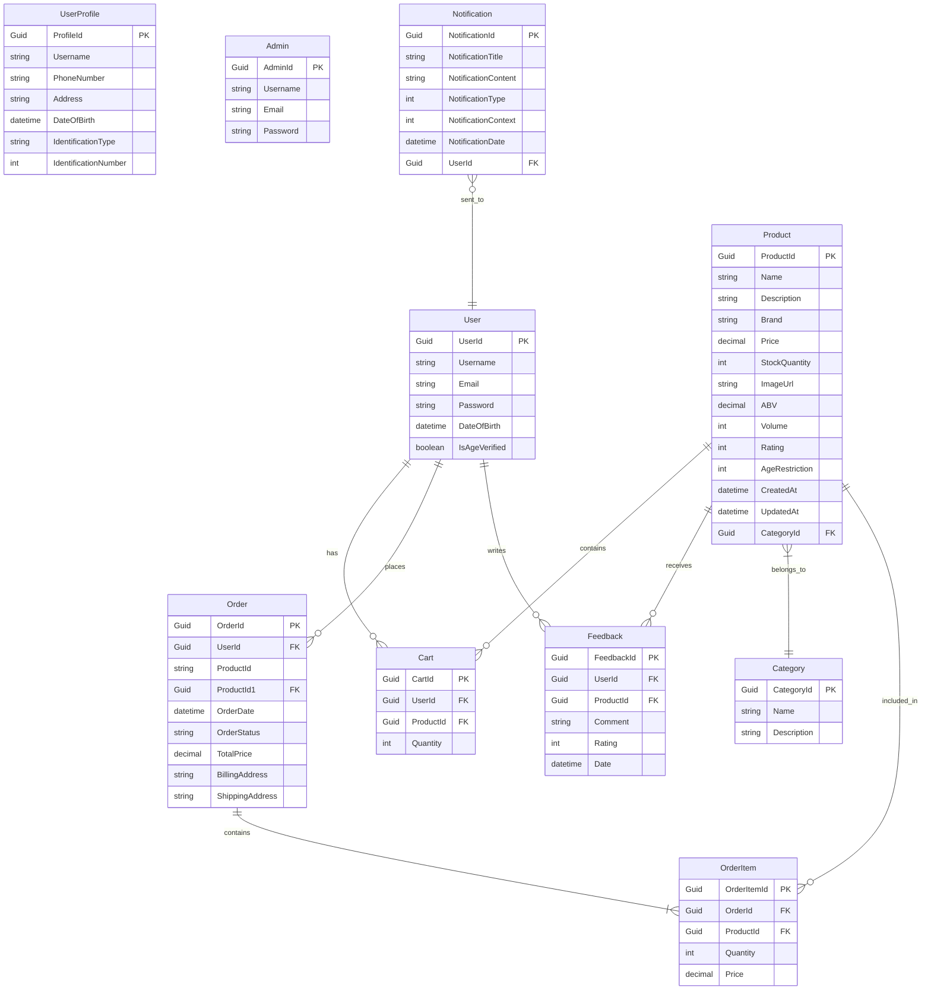

# One Bottle

## About

**One Bottle** is a web application that allows users to create and manage their own online store. It provides a user-friendly interface for managing categories, products, orders, customers and feedbacks/reviews. The application is built using .NET Core and C# in server-side, uses EF-Core for dealing with MSSQL database and React with Typescript for the front-end.\*

## Features

- User authentication and authorization
- Categories management
- Product management
- Order management
- Customer management
- Admin dashboard
- User management
- Feedback and feedback management
- Shopping Cart
- In app notification


## Database Diagram


## Getting Started

To get started with One Bottle, follow these steps:

1. Clone the repository:

   Using https:

```bash
git clone https://github.com/kshetritej/OneBottle.git
```

or,
Using ssh:

```bash
git clone git@github.com:kshetritej/OneBottle.git
```

2. Navigate to the project directory:

```bash
cd OneBottle
```
> [!TIP]
> You need to setup your database first, the `ConnectioString` is in `appsettings.json` file. Change that according to your database.
> Migrate the models with `dotnet ef migrations add InitialMigration` and then apply the migrations with `dotnet ef database update`.
3. Restore NuGet packages:

```bash
cd server; dotnet restore
```

4. Build the project:

```bash
dotnet build
```

5. Run the application:

```bash
dotnet run
```

6. Setup Frontend

```bash
cd client/
```

7.Run Frontend

```bash
pnpm install && pnpm dev
```
> [!NOTE]
> For running frontend you need have have `node` installed in your system and can also use `npm` instead of `pnpm`, for using `pnpm` you will need to install it first.

## Contributing
This is a personal project I am not sure, would I be looking further into it or not. No contributions will reviewed or merged!
## License

This project is licensed under the MIT License. See the [LICENSE](LICENSE) file for more information.
